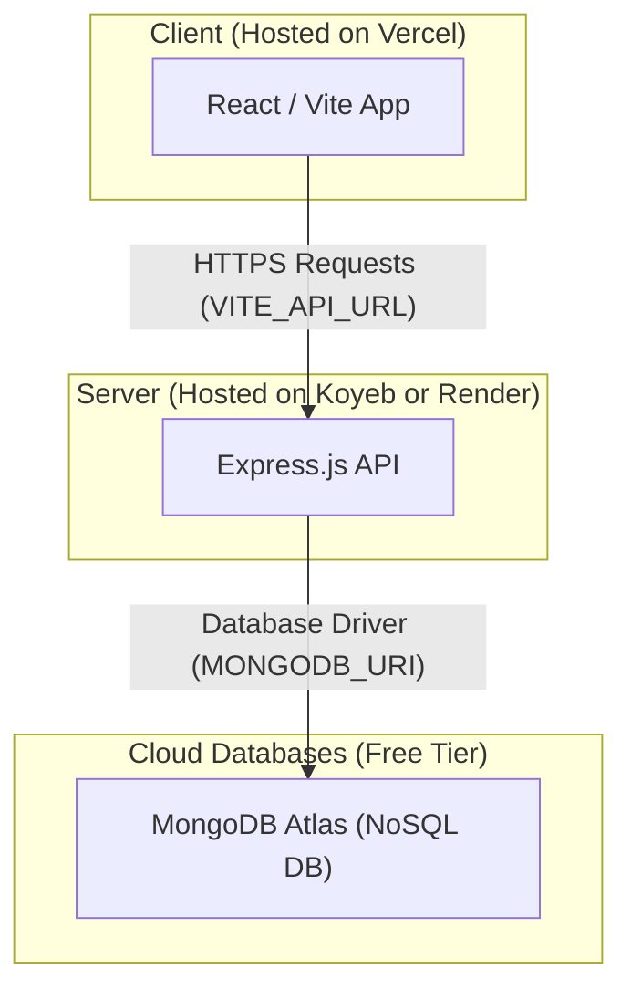

# 🚀 Complete Free Production Deployment Guide for News Blitz (Core Features Only)

This guide details a step-by-step path to deploy the **core features** of **News Blitz** (RSS feeds, news aggregation, user notes, and registration/login systems) to production 100% free, with high performance, continuous integration (CI/CD), and robust cloud databases.

---

## 📐 Production Architecture Overview

This core deployment uses a high-performance, completely free, and serverless stack:



---

## 🛠️ Step-by-Step Deployment Roadmap

### Phase 1: Database Setup

Your MongoDB configuration is already production-ready! You are using **MongoDB Atlas** which has a perpetual free tier (512MB storage), more than enough for thousands of news feeds and user notes.

> [!IMPORTANT]
> **Whitelisting Production IP Addresses on MongoDB Atlas:**
> 1. Log into [MongoDB Atlas](https://cloud.mongodb.com/).
> 2. Navigate to **Network Access** under the Security section on the left sidebar.
> 3. Click **Add IP Address**.
> 4. Select **Allow Access from Anywhere** (IP: `0.0.0.0/0`).
>    *Reason:* Cloud hosting services like Koyeb or Render use dynamic IPs. Allowing `0.0.0.0/0` ensures your server can connect to the database even when its IP changes.

---

### Phase 2: Deploying the Backend (Express Server)

You can host your Express backend on **Koyeb** or **Render**.
- **Koyeb (Recommended):** High performance, always online, and does *not* go to sleep on inactivity.
- **Render:** Excellent and easy to use, but the free tier web service will "sleep" after 15 minutes of no web traffic (causing a 30-second delay on first load).

#### Option A: Deploying on Koyeb (Recommended - No Sleeping)
1. Sign up on [Koyeb](https://www.koyeb.com/). No credit card is required.
2. Push your project to a GitHub repository.
3. On the Koyeb Dashboard, click **Create Service** -> **Web Service**.
4. Choose **GitHub** as the source, authorize Koyeb, and select your repository.
5. In the builder settings:
   - **Branch:** `main`
   - **Work Directory:** `/server` (tells Koyeb to run the backend folder)
   - **Build Command:** `npm install`
   - **Run Command:** `node server.js`
6. Add the following **Environment Variables** (see table below).
7. Under **Ports**, ensure the port is set to **`5000`** (or whatever port you configure) and HTTP routing is enabled.
8. Click **Deploy**. Koyeb will build the backend and provide a public URL like `https://your-app-name.koyeb.app`.

#### Option B: Deploying on Render (Easy Setup)
1. Sign up on [Render](https://render.com/).
2. Click **New +** -> **Web Service**.
3. Connect your GitHub repository.
4. Configure:
   - **Root Directory:** `server`
   - **Runtime:** `Node`
   - **Build Command:** `npm install`
   - **Start Command:** `node server.js`
   - **Instance Type:** `Free`
5. Click **Advanced** and add your **Environment Variables** (see table below).
6. Click **Create Web Service**. Once built, copy your service's URL (e.g. `https://newsblitz-backend.onrender.com`).

#### Required Backend Environment Variables Checklists

| Variable Name | Value Description | Example / Recommended Setup |
| :--- | :--- | :--- |
| `PORT` | The port the backend listens on | `5000` |
| `MONGODB_URI` | Connection string to your cloud DB | *Your existing Atlas URI* |
| `CLIENT_URL` | Deployed Frontend URL (Vercel URL) | `https://newsblitz.vercel.app` (Set after Phase 3) |
| `JWT_SECRET` | Secret token for signing login tokens | *A long random string* |

---

### Phase 3: Deploying the Frontend (React Client)

Deploying React apps to **Vercel** or **Netlify** is completely free, secure, and blazing fast.

#### Deploying on Vercel
1. Sign up on [Vercel](https://vercel.com/) using your GitHub account.
2. Click **Add New** -> **Project**.
3. Import your GitHub repository.
4. Configure the Project settings:
   - **Root Directory:** Click Edit and select **`client`** (Vite frontend folder).
   - **Framework Preset:** Choose **Vite**.
   - **Build Command:** `npm run build`
   - **Output Directory:** `dist`
5. Open the **Environment Variables** dropdown and add:
   - **Key:** `VITE_API_URL`
   - **Value:** `https://your-backend-url.koyeb.app/api/` (Use the URL of the backend deployed in Phase 2. **Be sure to include the trailing `/api/`**).
6. Click **Deploy**. Vercel will build and host your site on a free subdomain like `https://news-blitz-client.vercel.app`.

---

## 🔒 Post-Deployment Connection (CORS Bind)

Once both frontend and backend are deployed, make sure to wire them together using environment variables:

1. Copy your Vercel frontend URL (e.g. `https://newsblitz-client.vercel.app`).
2. Go to your **Backend hosting settings** (Koyeb or Render Dashboard).
3. Update the `CLIENT_URL` environment variable to match your Vercel URL.
4. Redeploy the backend.
5. Copy your backend's API URL (e.g. `https://newsblitz-backend.koyeb.app/api/`).
6. Go to your **Vercel Project Settings** -> **Environment Variables**.
7. Ensure `VITE_API_URL` is set to your production backend URL.
8. Redeploy the frontend if needed.

---

## 🤖 How to Enable the Chatbot (ChromaDB + AI) Later

Whenever you are ready to introduce the AI Q&A chatbot, follow these simple steps to bring it online:

### Step 1: Re-enable the "Bot" Tab in Navigation
In [client/src/components/BottomNav.jsx](file:///c:/Users/ARJUN-029/Desktop/News%20Blitz/client/src/components/BottomNav.jsx), uncomment the Bot navigation item:
```diff
 const navItems = [
   { label: "Feed", path: "/user/news-feed", icon: LayoutGrid },
   { label: "All News", path: "/user/all-news", icon: Newspaper },
-  // { label: "Bot", path: "/user/news-bot", icon: Bot },
+  { label: "Bot", path: "/user/news-bot", icon: Bot },
   { label: "Note", path: "/user/notes", icon: Book },
   { label: "Star", path: "/user/notes", icon: Star },
 ];
```

### Step 2: Deploy ChromaDB on Hugging Face Spaces (Perpetual Free Vector DB)
1. Go to [Hugging Face](https://huggingface.co/) and create a **New Space**.
2. Set Space SDK as **Docker** -> **Blank**. Make it **Public**.
3. Create a `Dockerfile` in the Space files tab with:
   ```dockerfile
   FROM ghcr.io/chroma-core/chroma:latest
   ```
4. Commit the file. Copy the Direct URL once running (e.g. `username-space-name.hf.space`).

### Step 3: Add Chatbot/Chroma Env Variables to Your Deployed Backend
Add these environment variables to your Koyeb or Render backend environment settings:

| Variable Name | Value |
| :--- | :--- |
| `OPENAI_API_KEY` | *Your OpenRouter or OpenAI API key* |
| `GEMINI_API_KEY` | *Your Gemini Embedding API key* |
| `CHROMA_HOST` | `username-space-name.hf.space` (from Step 2) |
| `CHROMA_PORT` | `443` |
| `CHROMA_SSL` | `true` |

Once added, redeploy both frontend and backend. The scraper cron job will automatically index feeds into ChromaDB, and users will see the "Bot" tab and chat with the articles!
